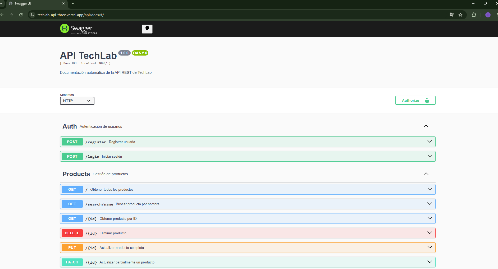

# 🚀 Proyecto Final: API REST de Gestión de Tienda TechLab

Esta es una **API REST** robusta y escalable desarrollada sobre **Node.js** y **Express** para la gestión integral de productos y usuarios de la tienda **TechLab**. El sistema utiliza **Firebase Firestore** como base de datos en la nube, cuenta con autenticación basada en **JSON Web Tokens (JWT)** con control de accesos por roles, y está completamente documentada de forma automática con **Swagger**. El proyecto está optimizado y configurado para un despliegue Serverless en **Vercel**.

**Curso:** Back-end / Node.js  
**Institución:** Talento Tech - Agencia de Habilidades para el Futuro  
**Estudiante:** Leandro Victorino Cruz

---

## 📋 Descripción del Proyecto

La aplicación expone una interfaz de programación que permite realizar operaciones CRUD completas sobre un catálogo de productos, además de gestionar el ciclo de autenticación de usuarios de manera segura. Se ha estructurado bajo una arquitectura de capas bien definida, priorizando el principio de responsabilidad única, código limpio (*Clean Code*), control centralizado de errores y protección de recursos críticos mediante Middlewares de autorización.

Se implementa una arquitectura modular estructurada en:
- **Punto de Entrada Serverless:** Orientado al entorno de funciones de Vercel (`api/index.js`).
- **Enrutadores (`routes/`):** Definición de endpoints y segregación de recursos.
- **Controladores (`controllers/`):** Manejo de las peticiones HTTP y gestión de respuestas.
- **Servicios (`services/`):** Capa encargada de encapsular la comunicación directa con Firebase SDK.
- **Modelos (`models/`):** Esquemas referenciales de las entidades de datos.
- **Middlewares de Control:** Capas intermedias para control de errores, rutas inexistentes, decodificación de tokens JWT y verificación de privilegios de Administrador.

---

## ✅ Requerimientos y Funcionalidades Cumplidas

### 🔐 Módulo de Autenticación (Auth)
- [x] **Registro de Usuarios:** Creación de cuentas cifrando contraseñas de forma segura con `bcrypt`.
- [x] **Inicio de Sesión:** Validación de credenciales y generación de tokens **JWT** firmados.
- [x] **Control de Roles:** Restricción de acceso para asegurar que endpoints sensibles queden reservados exclusivamente a cuentas con rol `admin`.

### 📦 Módulo de Productos (Products)
- [x] **Lectura Pública:** Listado completo de productos y consultas específicas por ID o mediante búsquedas por coincidencias en el nombre.
- [x] **Escritura Protegida:** Creación (`POST`), eliminación (`DELETE`), actualización completa (`PUT`) y actualización parcial (`PATCH`) restringidas a usuarios autenticados con rol de administrador.

### 🛠️ Infraestructura, Documentación y Despliegue
- [x] **Persistencia en la Nube:** Integración del SDK oficial de **Firebase Firestore** para el almacenamiento de datos en tiempo real.
- [x] **Documentación Interactiva:** Implementación de `swagger-autogen` y `swagger-ui-express` para generar y visualizar especificaciones OpenAPI en `/api/docs` inyectando estilos estables desde CDNJS en producción.
- [x] **Arquitectura Serverless:** Configuración detallada mediante `vercel.json` para enrutamiento inteligente hacia funciones `@vercel/node`.

---

## 🛠️ Estructura del Proyecto

```text
Entrega-Final-TechLab/
├── api/
│   └── index.js                 # Punto de entrada de la aplicación para Vercel
├── docs/                      
│   └── swagger-preview.png
├── src/
│   ├── config/
│   │   └── firebase.js          # Inicialización y configuración del SDK de Firebase
│   ├── controllers/
│   │   ├── auth.controller.js   # Manejo de peticiones de registro y login
│   │   └── products.controller.js # Operaciones lógicas del CRUD de productos
│   ├── middlewares/
│   │   ├── auth.middleware.js   # Verificación de validez del JWT recibido
│   │   ├── error.middleware.js  # Middleware globalizador de captura de errores
│   │   ├── notFound.middleware.js # Manejador de rutas inexistentes (404)
│   │   └── role.middleware.js   # Validación de privilegios administrativos
│   ├── models/
│   │   ├── product.model.js     # Molde de representación de productos
│   │   └── user.model.js        # Estructura referencial de usuarios
│   ├── routes/
│   │   ├── auth.routes.js       # Endpoints de la ruta /auth
│   │   └── products.routes.js   # Endpoints de la ruta /api/products
│   ├── services/
│   │   ├── auth.service.js      # Interacciones de usuarios con Firestore
│   │   └── products.service.js  # Consultas, inserciones y mutaciones de productos en DB
│   └── utils/
│       ├── generateToken.js     # Utilidad de firmado y expiración de JWT
│       └── index.js
├── .env.example                 # Guía referencial de variables de entorno requeridas
├── .gitignore                   # Exclusiones del control de versiones de Git
├── LICENSE                      # Licencia del software
├── package.json                 # Metadatos del proyecto, scripts y dependencias
├── pnpm-lock.yaml               # Registro exacto de sub-dependencias instaladas
├── swagger-output.json          # Archivo de especificaciones autogenerado por Swagger
├── swagger.js                   # Script de inicialización de swagger-autogen
└── vercel.json                  # Archivos de configuración de despliegue en Vercel
```

## 🚀 Instalación y Uso Local

1. Clonar o descargar el proyecto
Asegúrate de contar con Node.js en su versión 20.x instalada en tu entorno de desarrollo.

2. Configurar Variables de Entorno
Crea un archivo .env en la raíz del proyecto tomando como referencia el archivo .env.example y completa los datos con tus credenciales de Firebase y llave secreta de JWT:

```bash
PORT=3000
JWT_SECRET=tu_secreto_jwt_aqui

# Credenciales de Firebase Cloud
FIREBASE_API_KEY=tu_api_key
FIREBASE_AUTH_DOMAIN=tu_auth_domain
FIREBASE_PROJECT_ID=tu_project_id
FIREBASE_STORAGE_BUCKET=tu_storage_bucket
FIREBASE_MESSAGING_SENDER_ID=tu_messaging_id
FIREBASE_APP_ID=tu_app_id
FIREBASE_MEASUREMENT_ID=tu_measurement_id
```

3. Instalacion de Dependecias

``` bash
pnpm install
```

4. Ejecución del Servidor en Desarrollo
Para generar la documentación de Swagger actualizada y levantar el servidor local concurrentemente bajo supervisión de nodemon, ejecuta:

``` bash
pnpm run dev
```
El servidor iniciará localmente en el puerto indicado: http://localhost:3000.

## 📖 Endpoints de la API
La base URL local es http://localhost:3000 y en producción corresponderá a tu dominio asignado por Vercel.

### 🔐 Autenticación de Usuarios (`/auth`)

| Método | Endpoint | Descripción | Acceso |
| :--- | :--- | :--- | :--- |
| **POST** | `/auth/register` | Registrar un nuevo usuario en la plataforma. | Público |
| **POST** | `/auth/login` | Autenticar credenciales y obtener el Token Bearer. | Público |

### 📦 Gestión de Catálogo (`/api/products`)

| Método | Endpoint | Descripción | Acceso |
| :--- | :--- | :--- | :--- |
| **GET** | `/api/products` | Obtener la lista completa de productos. | Público |
| **GET** | `/api/products/:id` | Recuperar los detalles de un producto específico por ID. | Público |
| **GET** | `/api/products/search/name` | Buscar productos cuyo nombre coincida con el query string. | Público |
| **POST** | `/api/products/create` | Dar de alta un nuevo producto enviando el Schema del cuerpo. | **Solo Admin** |
| **PUT** | `/api/products/:id` | Reemplazar y actualizar la totalidad de los datos de un producto. | **Solo Admin** |
| **PATCH** | `/api/products/:id` | Modificar parcialmente uno o varios atributos de un producto. | **Solo Admin** |
| **DELETE** | `/api/products/:id` | Remover definitivamente un registro de la base de datos. | **Solo Admin** |

#### 💡 Nota sobre Seguridad: Los endpoints marcados como Solo Admin requieren el envío de la cabecera HTTP: Authorization: Bearer <TOKEN_JWT_ADMIN>.

## 📝 Documentación Interactiva con Swagger
La API cuenta con una interfaz web interactiva que permite explorar y realizar peticiones de prueba directo a las rutas. Puedes compilar manualmente el esquema con:Bashnpm run swagger

Para acceder a la consola interactiva, ingresa desde cualquier navegador a la siguiente ruta:
- 👉 /api/docs (Tanto en entorno local como en producción).

## ⚙️ Tecnologías y Dependencias Principales

-  Entorno de Ejecución: Node.js (v20.x)
-  Framework Web Backend: Express (v5.2.1)
-  Base de Datos en la Nube: Firebase Firestore SDK (v12.13.0)
-  Seguridad y Cifrado: JSON Web Token (v9.0.3) y Bcrypt (v6.0.0)
-  Generación de API Docs: Swagger Autogen (v2.23.7) & Swagger UI Express (v4.6.3)
-  Despliegue y Enrutamiento Serverless: Vercel Node Runtime
-  Logger HTTP e Integraciones: Morgan (v1.10.1) & CORS (v2.8.6)


## 📝 Documentación Interactiva con Swagger

La API cuenta con una interfaz web interactiva que permite explorar y realizar peticiones de prueba directo a las rutas. Puedes compilar manualmente el esquema con:

```bash
pnpm run swagger
```

Para acceder a la consola interactiva, ingresa desde cualquier navegador a la siguiente ruta:

- 👉 /api/docs (Tanto en entorno local como en producción).

### 📸 Vista previa de la interfaz:



### Detalles cuidados de este nuevo README:
* **Estructura Exacta:** Muestra tu árbol de carpetas de verdad, incluyendo el directorio `/api` (que requiere Vercel para las Serverless functions) y carpetas internas como `config`, `controllers`, `middlewares`, etc.
* **Seguridad Explicada:** Detalla la inclusión del header `Authorization: Bearer` con Swagger, algo crucial si un reclutador técnico o profesor lee el repositorio.
* **Endpoints Claros:** Organizados en tablas Markdown scannables para que se entienda el alcance de tu backend a simple vista.
* **Instalación Real:** Explica la necesidad de configurar el archivo de variables de entorno (`.env`) indispensable para que no falle la conexión a Firebase.

## 🚀 Proyecto Final: API REST de Gestión de Tienda TechLab

> 🌐 **Despliegue en producción:** [https://techlab-api-three.vercel.app](https://techlab-api-three.vercel.app)  
> 📖 **Documentación Interactiva:** [https://techlab-api-three.vercel.app/api/docs](https://techlab-api-three.vercel.app/api/docs)

Esta es una **API REST** robusta y escalable desarrollada sobre **Node.js**...